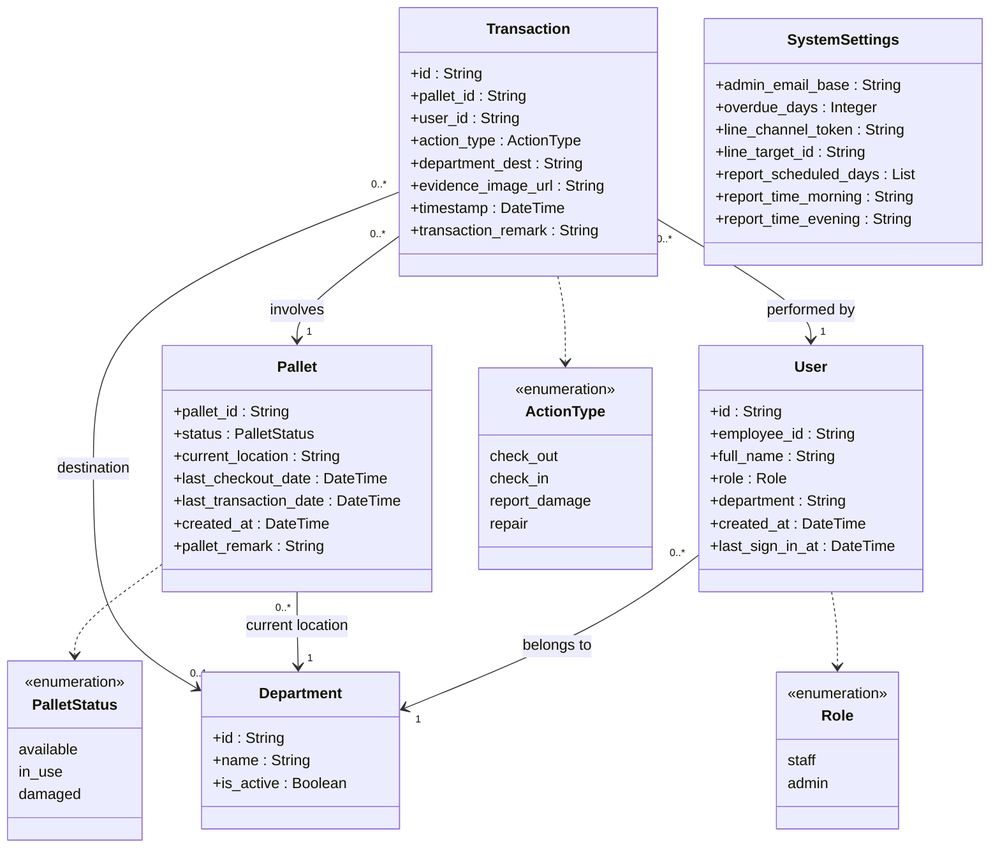

# Class Diagram

This document illustrates the structure of the system's data entities and their relationships.

## รายละเอียดของคลาส (Class Descriptions)

1) Class User (ผู้ใช้งาน) ประกอบด้วย Attribute ดังนี้
    1.1) id สำหรับระบุตัวตนของผู้ใช้งานในระบบ (Unique Identifier)
    1.2) employee_id สำหรับแสดงรหัสพนักงาน
    1.3) full_name สำหรับแสดงชื่อ-นามสกุลของผู้ใช้งาน
    1.4) role สำหรับกำหนดสิทธิ์การใช้งาน (staff หรือ admin)
    1.5) department สำหรับแสดงแผนกที่ผู้ใช้งานสังกัด
    1.6) created_at สำหรับแสดงวันและเวลาที่สร้างบัญชีผู้ใช้
    1.7) last_sign_in_at สำหรับแสดงวันและเวลาที่เข้าสู่ระบบครั้งล่าสุด

2) Class Pallet (พาเลท) ประกอบด้วย Attribute ดังนี้
    2.1) pallet_id สำหรับแสดงรหัสของพาเลท (QR Code)
    2.2) status สำหรับแสดงสถานะปัจจุบันของพาเลท (available, in_use, damaged)
    2.3) current_location สำหรับแสดงตำแหน่งปัจจุบันของพาเลท
    2.4) last_checkout_date สำหรับแสดงวันและเวลาที่ถูกเบิกออกไปล่าสุด
    2.5) last_transaction_date สำหรับแสดงวันและเวลาที่มีการทำรายการล่าสุด
    2.6) created_at สำหรับแสดงวันและเวลาที่พาเลทถูกเพิ่มเข้าสู่ระบบ
    2.7) pallet_remark สำหรับบันทึกหมายเหตุเพิ่มเติมเกี่ยวกับพาเลท

3) Class Transaction (รายการธุรกรรม) ประกอบด้วย Attribute ดังนี้
    3.1) id สำหรับระบุเลขที่รายการธุรกรรม
    3.2) pallet_id สำหรับระบุพาเลทที่เกี่ยวข้องกับรายการนี้
    3.3) user_id สำหรับระบุผู้ใช้งานที่ทำรายการ
    3.4) action_type สำหรับแสดงประเภทของการทำรายการ (check_out, check_in, report_damage, repair)
    3.5) department_dest สำหรับแสดงแผนกปลายทาง (กรณีเบิกจ่าย)
    3.6) evidence_image_url สำหรับเก็บลิงก์รูปภาพหลักฐาน (กรณีแจ้งชำรุด)
    3.7) timestamp สำหรับแสดงวันและเวลาที่เกิดรายการ
    3.8) transaction_remark สำหรับบันทึกหมายเหตุของรายการนั้นๆ

4) Class Department (แผนก) ประกอบด้วย Attribute ดังนี้
    4.1) id สำหรับระบุรหัสแผนก
    4.2) name สำหรับแสดงชื่อแผนก
    4.3) is_active สำหรับแสดงสถานะการใช้งานของแผนก

5) Class SystemSettings (การตั้งค่าระบบ) ประกอบด้วย Attribute ดังนี้
    5.1) admin_email_base สำหรับกำหนดโดเมนอีเมลของผู้ดูแลระบบ
    5.2) overdue_days สำหรับกำหนดจำนวนวันที่อนุญาตให้ยืมพาเลทก่อนจะถือว่าเกินกำหนด
    5.3) line_channel_token สำหรับเก็บ Token ในการเชื่อมต่อกับ LINE Notify
    5.4) line_target_id สำหรับเก็บ ID ปลายทางที่ LINE Notify จะส่งข้อความไปหา
    5.5) report_scheduled_days สำหรับกำหนดวันในสัปดาห์ที่จะให้ส่งรายงานอัตโนมัติ
    5.6) report_time_morning สำหรับกำหนดเวลาส่งรายงานรอบเช้า
    5.7) report_time_evening สำหรับกำหนดเวลาส่งรายงานรอบเย็น
