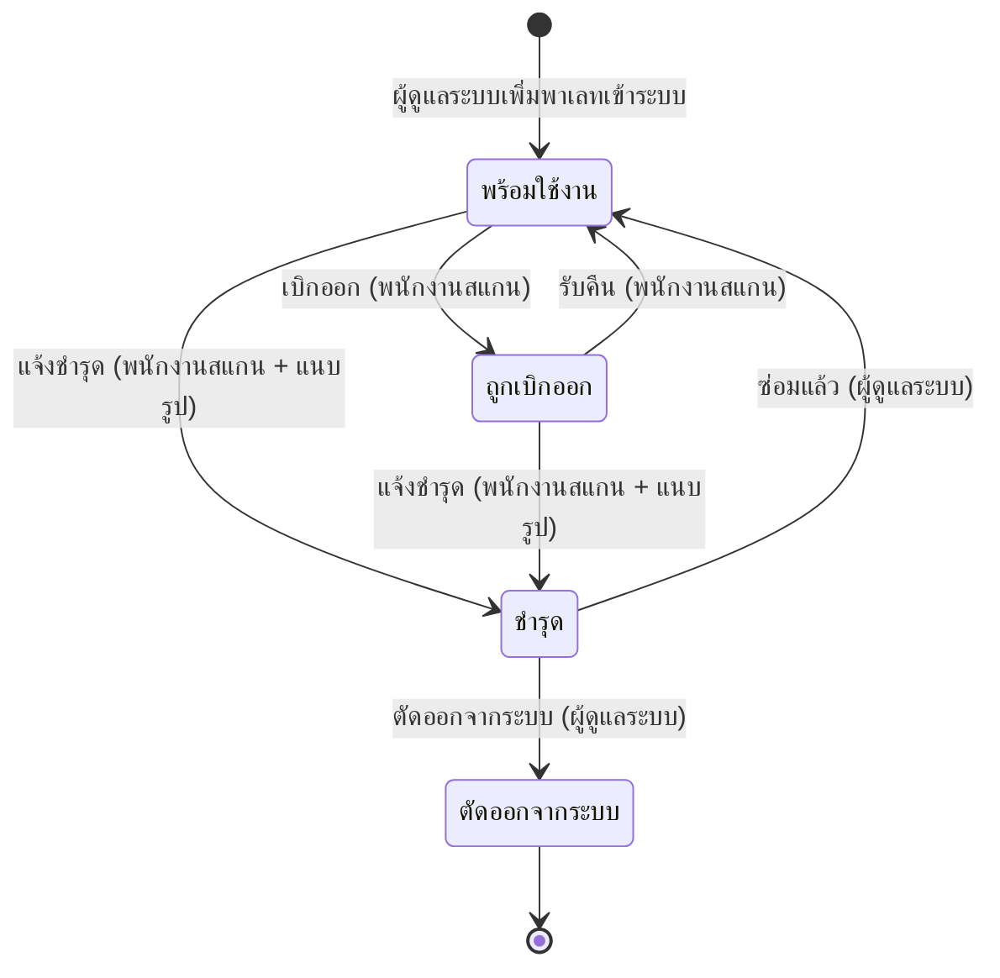

# บทที่ 1 ภาพรวมระบบ

## 1.1 ระบบนี้แก้ปัญหาอะไร

คลังสินค้าที่ใช้พาเลทหมุนเวียนระหว่างแผนก มักตอบคำถามพื้นฐานสามข้อไม่ได้

1. ตอนนี้พาเลทแต่ละใบอยู่ที่ไหน
2. ใครเป็นคนเบิกออกไป และเบิกไปนานแค่ไหนแล้ว
3. พาเลทที่ชำรุดมีกี่ใบ ซ่อมไปแล้วกี่ใบ

ระบบจัดการพาเลทแก้ปัญหานี้ด้วยการติด QR Code ไว้ที่พาเลททุกใบ แล้วให้พนักงาน
สแกนทุกครั้งที่มีการเคลื่อนย้าย ระบบจะบันทึกไว้ว่าใครทำรายการอะไร กับพาเลทใบไหน
เมื่อไร และส่งไปที่แผนกใด ผู้ดูแลระบบจึงเห็นสถานะของพาเลททุกใบได้ทันทีจากหน้าจอเดียว
พร้อมรายงานสรุปที่ส่งเข้า LINE ให้อัตโนมัติตามเวลาที่ตั้งไว้

## 1.2 ผู้ใช้ 2 บทบาท และอุปกรณ์ที่ใช้

| บทบาท                       | อุปกรณ์               | หน้าที่                                                                                                                                  |
| -------------------------------- | ---------------------------- | ----------------------------------------------------------------------------------------------------------------------------------------------- |
| **พนักงาน**         | โทรศัพท์มือถือ | สแกน QR เพื่อเบิกออก รับคืน และแจ้งพาเลทชำรุด ดูประวัติการทำรายการของตัวเอง |
| **ผู้ดูแลระบบ** | คอมพิวเตอร์       | ดูภาพรวมทั้งคลัง จัดการข้อมูลพาเลท ผู้ใช้งาน สถานที่ และตั้งค่าระบบ              |

ระบบเลือกหน้าจอจาก **บทบาทที่บันทึกไว้ในบัญชี** ไม่ได้เลือกจากขนาดหน้าจอ
บัญชีพนักงานที่เปิดบนคอมพิวเตอร์จึงยังเห็นหน้าจอมือถือเหมือนเดิม และบัญชีผู้ดูแลระบบ
ที่เปิดบนมือถือก็ยังเห็นหน้าจอผู้ดูแลระบบ ผู้ใช้ทั้งสองกลุ่มไม่มีหน้าจอไหนใช้ร่วมกันเลย
ยกเว้นหน้าเข้าสู่ระบบ

> **หมายเหตุ** บัญชีหนึ่งมีได้บทบาทเดียวเท่านั้น หากต้องการสลับบทบาทเพื่อทดสอบ
> ต้องออกจากระบบแล้วเข้าใหม่ด้วยอีกบัญชีหนึ่ง

## 1.3 คำศัพท์ที่ต้องรู้

### รหัสพาเลท

รหัสประจำตัวของพาเลทแต่ละใบ เช่น `P001` เป็นค่าที่พิมพ์อยู่ใน QR Code
และเป็นค่าที่ใช้อ้างอิงพาเลทใบนั้นทั้งระบบ พาเลทสองใบมีรหัสซ้ำกันไม่ได้

### สถานะของพาเลท

พาเลททุกใบมีสถานะเดียว ณ เวลาหนึ่ง มีทั้งหมดสี่สถานะ

| สถานะ                           | ความหมาย                                                                                                              |
| ------------------------------------ | ----------------------------------------------------------------------------------------------------------------------------- |
| **พร้อมใช้งาน**     | อยู่ในคลัง รอให้เบิก                                                                                       |
| **ถูกเบิกออก**       | ถูกเบิกไปอยู่กับแผนกปลายทางแล้ว                                                                |
| **ชำรุด**                 | ถูกแจ้งชำรุดไว้ รอผู้ดูแลระบบตัดสินใจว่าจะซ่อมหรือตัดออกจากระบบ |
| **ตัดออกจากระบบ** | เลิกใช้งานถาวร                                                                                                  |

**ตัดออกจากระบบ** เป็นสถานะปลายทาง พาเลทเข้าสถานะนี้ได้จากสถานะชำรุดเท่านั้น
และเมื่อเข้าแล้วจะไม่กลับออกมาอีก พาเลทที่ถูกตัดออกจากระบบจะไม่ถูกนับรวมใน
ตัวเลขสรุปทุกตัวบนหน้าภาพรวม และสแกนซ้ำไม่ได้ แต่ประวัติทั้งหมดยังอยู่ครบ

### ประเภทรายการ

ทุกครั้งที่สถานะของพาเลทเปลี่ยน ระบบจะบันทึกเป็นหนึ่งรายการ มีห้าประเภท

| ประเภทรายการ             | ใครทำ                                    | สถานะหลังทำรายการ |
| ------------------------------------ | --------------------------------------------- | ---------------------------------- |
| **เบิกออก**             | พนักงาน หรือผู้ดูแลระบบ | ถูกเบิกออก               |
| **รับคืน**               | พนักงาน หรือผู้ดูแลระบบ | พร้อมใช้งาน             |
| **แจ้งชำรุด**         | พนักงาน                                | ชำรุด                         |
| **ซ่อมแล้ว**           | ผู้ดูแลระบบ                        | พร้อมใช้งาน             |
| **ตัดออกจากระบบ** | ผู้ดูแลระบบ                        | ตัดออกจากระบบ         |

### สถานที่ / แผนกปลายทาง

รายชื่อปลายทางที่พาเลทถูกเบิกไป เช่น `Line A` หรือ `คลังสินค้า A` ผู้ดูแลระบบเป็นผู้
เพิ่มและปิดใช้งานรายชื่อนี้ (หัวข้อ 4.5) พนักงานจะเห็นเฉพาะสถานที่ที่ **เปิดใช้งาน**
อยู่เท่านั้นตอนเลือกปลายทาง

### เกินกำหนด

พาเลทที่ถูกเบิกออกไปแล้วยังไม่ถูกรับคืนภายในจำนวนวันที่กำหนดไว้ ค่าเริ่มต้นคือ
**7 วัน** ผู้ดูแลระบบเปลี่ยนค่านี้ได้ที่หน้าตั้งค่า (หัวข้อ 4.6) ระบบใช้ค่านี้ในสามที่:
ตัวเลข "เกินกำหนด" บนหน้าภาพรวม ตัวกรอง "เฉพาะเกินกำหนด" ในหน้าคลังพาเลท
และรายงานแจ้งเตือนที่ส่งเข้า LINE

### "ลบ" ไม่เหมือน "ตัดออกจากระบบ"

สองคำนี้ใกล้กันมากแต่ผลต่างกันสิ้นเชิง จำไว้ให้ขึ้นใจก่อนกดปุ่มในหัวข้อ 4.2

- **ตัดออกจากระบบ** — เลิกใช้พาเลทใบนั้น แต่ **ประวัติและรูปหลักฐานยังอยู่ครบ**
  ใช้เมื่อพาเลทพังจนซ่อมไม่ได้
- **ลบ** — ลบทั้งตัวพาเลทและ **ประวัติการทำรายการทั้งหมดของมัน** ออกจากฐานข้อมูล
  กู้คืนไม่ได้ ใช้เฉพาะกรณีสร้างข้อมูลผิดเท่านั้น

## 1.4 วงจรชีวิตของพาเลท

อ่านไดอะแกรมนี้ประกอบสองข้อสำคัญ

1. **ตัดออกจากระบบทำได้จากสถานะชำรุดเท่านั้น** สั่งตัดพาเลทที่ยังพร้อมใช้งาน
   หรือกำลังถูกเบิกออกอยู่ไม่ได้ ต้องแจ้งชำรุดก่อน
2. **งานหนึ่งชิ้นข้ามสองบทบาท** พนักงานเป็นคนแจ้งชำรุด แต่คนที่กด "ซ่อมแล้ว"
   หรือ "ตัดออกจากระบบ" คือผู้ดูแลระบบ พาเลทที่ค้างอยู่ในสถานะชำรุดจึงหมายความว่า
   ยังไม่มีใครตัดสินใจ ไม่ได้แปลว่าระบบค้าง

---

[← สารบัญ](index.md) | [บทที่ 2 เริ่มต้นใช้งาน →](02-getting-started.md)
