# Sequence Diagram Documentation

เอกสารฉบับนี้แสดงแผนภาพ Sequence Diagram ซึ่งเป็นแบบจำลองเชิงกิจกรรม (Dynamic Model) จำลองกระบวนการทำงานของระบบ NMT Pallet System แยกตาม Use Case เพื่ออธิบายลำดับขั้นตอนการโต้ตอบระหว่างผู้ใช้งาน (Actor) และส่วนประกอบต่างๆ ของระบบ

---

## 1. เข้าสู่ระบบ (Login)
**Use Case ID:** UC-001  
**Description:** กระบวนการตรวจสอบสิทธิ์การเข้าใช้งานระบบ

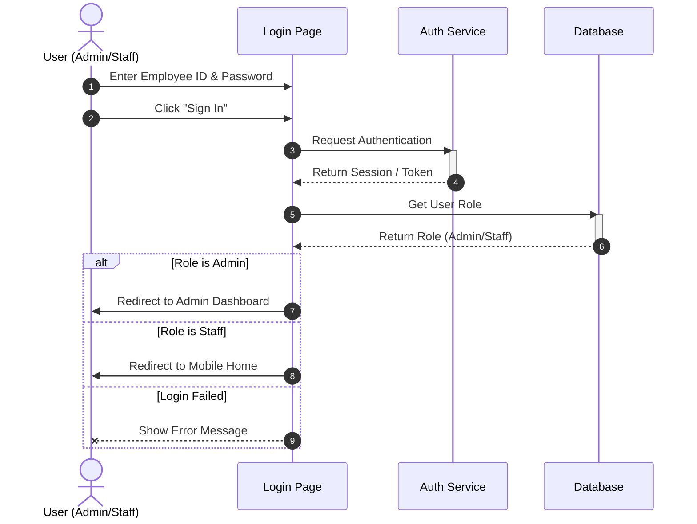

### คำอธิบายขั้นตอน
1. ผู้ใช้งานกรอกข้อมูลและกดปุ่ม Sign In
2. ระบบตรวจสอบสิทธิ์กับ Auth Service
3. ระบบตรวจสอบ Role ของผู้ใช้งานจากฐานข้อมูล
4. ระบบนำทางไปยังหน้าจอหลักตามสิทธิ์การใช้งาน

---

## 2. บันทึกรายการเบิกพาเลท (Check-out Pallet)
**Use Case ID:** UC-002  
**Description:** กระบวนการเบิกพาเลทออกจากคลังสินค้า

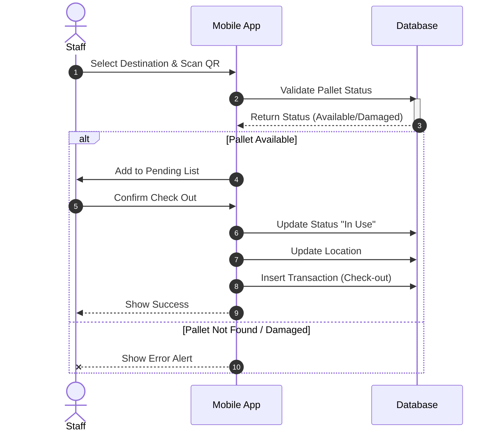

### คำอธิบายขั้นตอน
1. เจ้าหน้าที่เลือกปลายทางและสแกนพาเลท
2. ระบบตรวจสอบสถานะพาเลท
3. หากสถานะปกติ เพิ่มลงรายการและกดยืนยันเพื่อบันทึกการเบิก

---

## 3. บันทึกรายการคืนพาเลท (Check-in Pallet)
**Use Case ID:** UC-003  
**Description:** กระบวนการนำพาเลทกลับเข้าคลังสินค้า

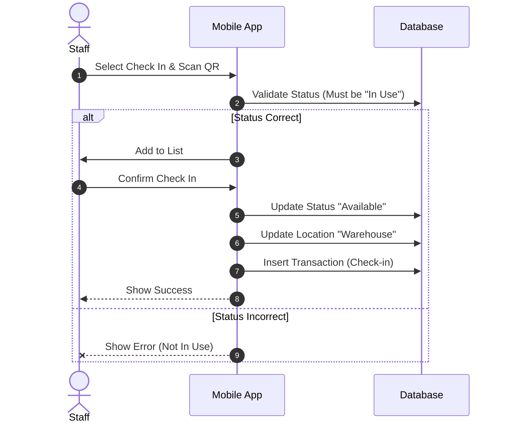

### คำอธิบายขั้นตอน
1. เจ้าหน้าที่สแกนพาเลทเพื่อคืน
2. ระบบตรวจสอบว่าพาเลทกำลังถูกใช้งานอยู่หรือไม่
3. เมื่อยืนยัน ระบบปรับสถานะเป็นว่างและบันทึกตำแหน่งเป็น Warehouse

---

## 4. บันทึกรายการแจ้งพาเลทชำรุด (Report Damage)
**Use Case ID:** UC-004  
**Description:** กระบวนการรายงานพาเลทเสียหาย

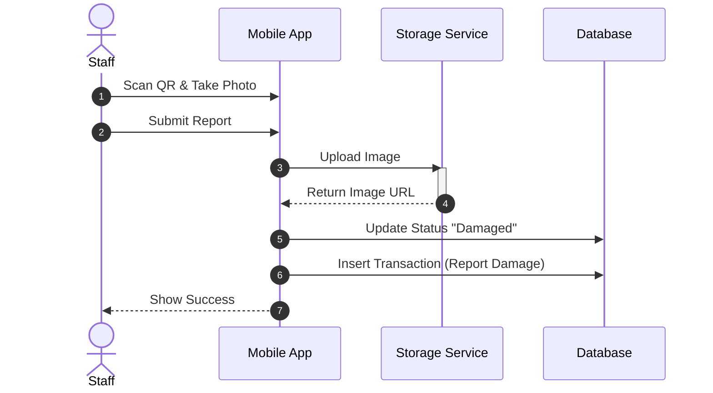

### คำอธิบายขั้นตอน
1. เจ้าหน้าที่สแกนพาเลทและถ่ายรูปหลักฐาน
2. ระบบอัปโหลดรูปภาพเก็บไว้ใน Storage
3. ระบบเปลี่ยนสถานะพาเลทเป็นชำรุดและบันทึกประวัติ

---

## 5. ตรวจสอบประวัติการทำรายการ (View History)
**Use Case ID:** UC-005  
**Description:** เจ้าหน้าที่ดูประวัติการเบิก-คืนของตนเอง

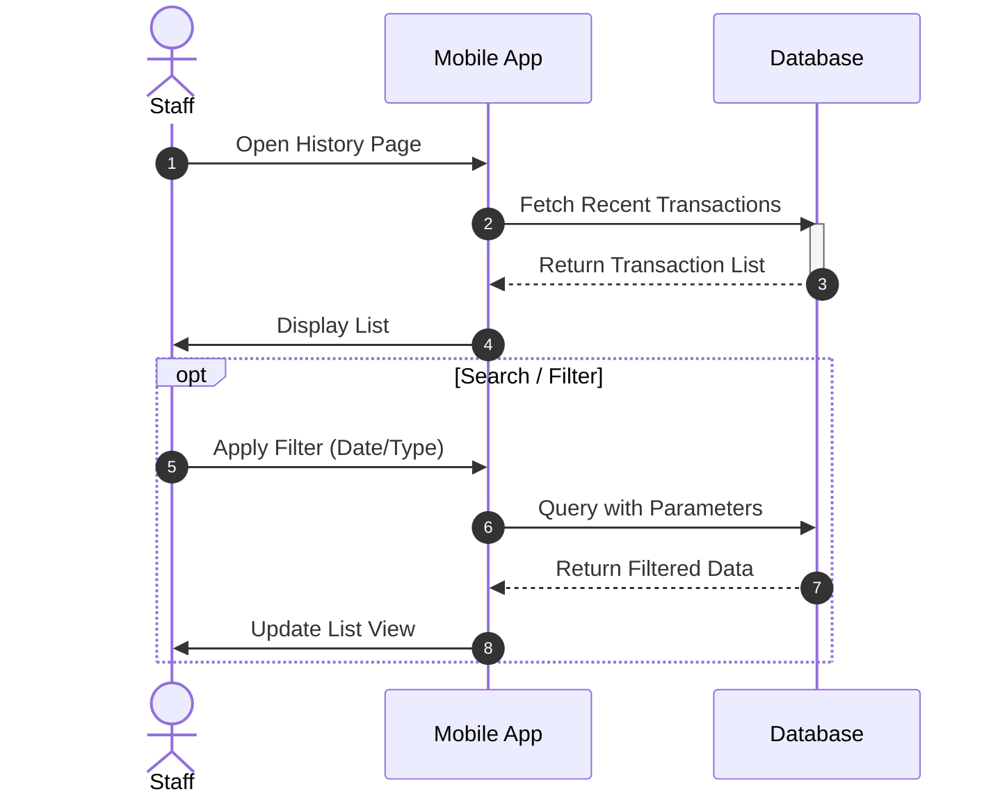

### คำอธิบายขั้นตอน
1. เจ้าหน้าที่เปิดหน้า History ระบบจะดึงข้อมูลประวัติล่าสุดมาแสดง
2. เจ้าหน้าที่สามารถคีย์ค้นหาหรือกรองประเภทรายการได้ ระบบจะดึงข้อมูลใหม่ตามเงื่อนไข

---

## 6. จัดการข้อมูลพาเลท (Manage Inventory)
**Use Case ID:** UC-006  
**Description:** Admin บริหารจัดการพาเลท (เพิ่ม/แก้ไข/ลบ)

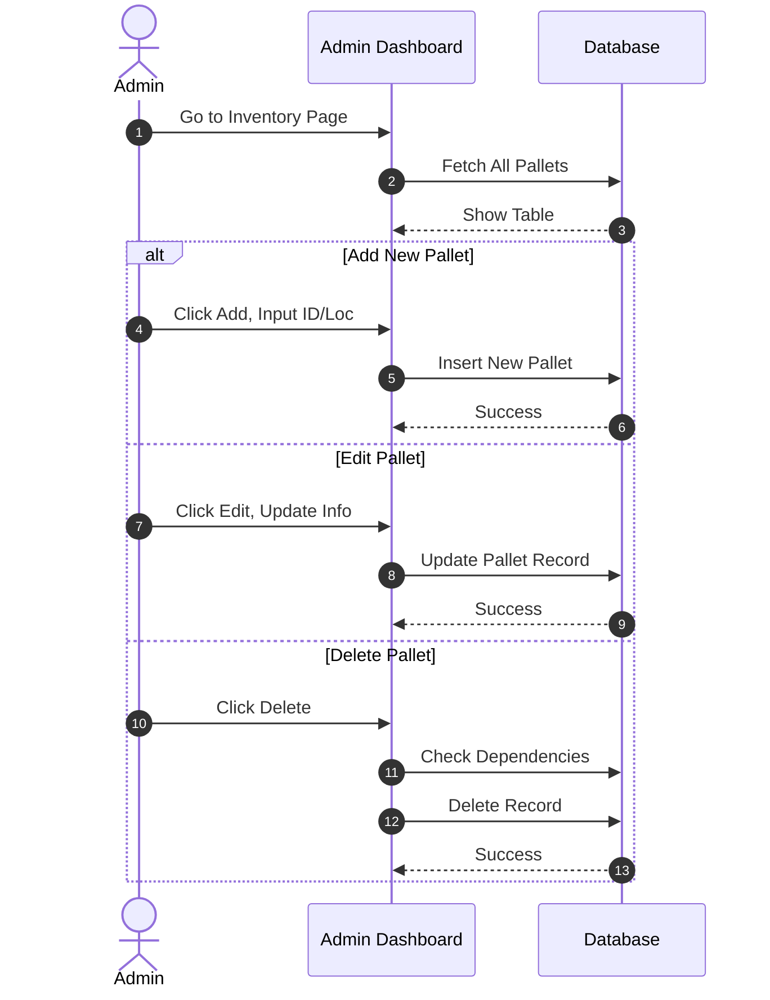

### คำอธิบายขั้นตอน
1. Admin ดูรายการพาเลททั้งหมด
2. สามารถเลือก Add เพื่อเพิ่มใหม่, Edit เพื่อแก้ไขรายละเอียด, หรือ Delete เพื่อลบข้อมูล
3. ระบบจะตรวจสอบความถูกต้อง (เช่น รหัสซ้ำ) ก่อนบันทึก

---

## 7. จัดการข้อมูลผู้ใช้งาน (Manage Users)
**Use Case ID:** UC-007  
**Description:** Admin จัดการพนักงานและสิทธิ์การใช้งาน

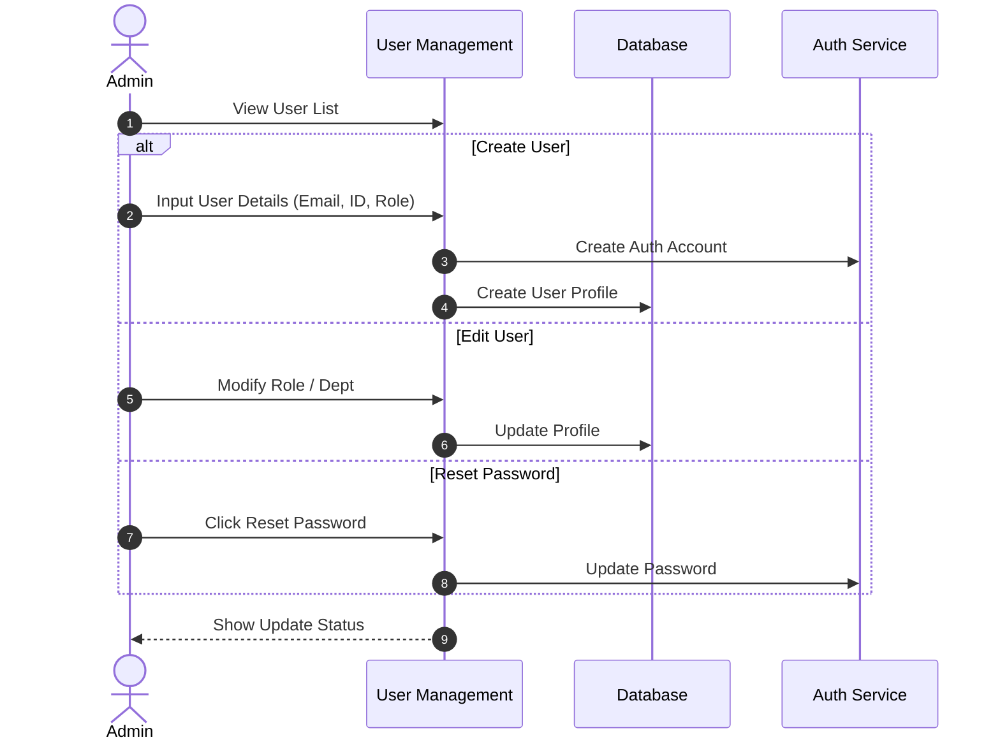

### คำอธิบายขั้นตอน
1. Admin จัดการบัญชีผู้ใช้
2. การสร้างผู้ใช้ใหม่จะทำการสร้างทั้งใน Auth Service และ Database Profile
3. สามารถแก้ไขสิทธิ์ (Role) หรือรีเซ็ตรหัสผ่านได้

---

## 8. จัดการข้อมูลสถานที่ (Manage Locations)
**Use Case ID:** UC-008  
**Description:** Admin จัดการรายชื่อแผนกและสถานที่

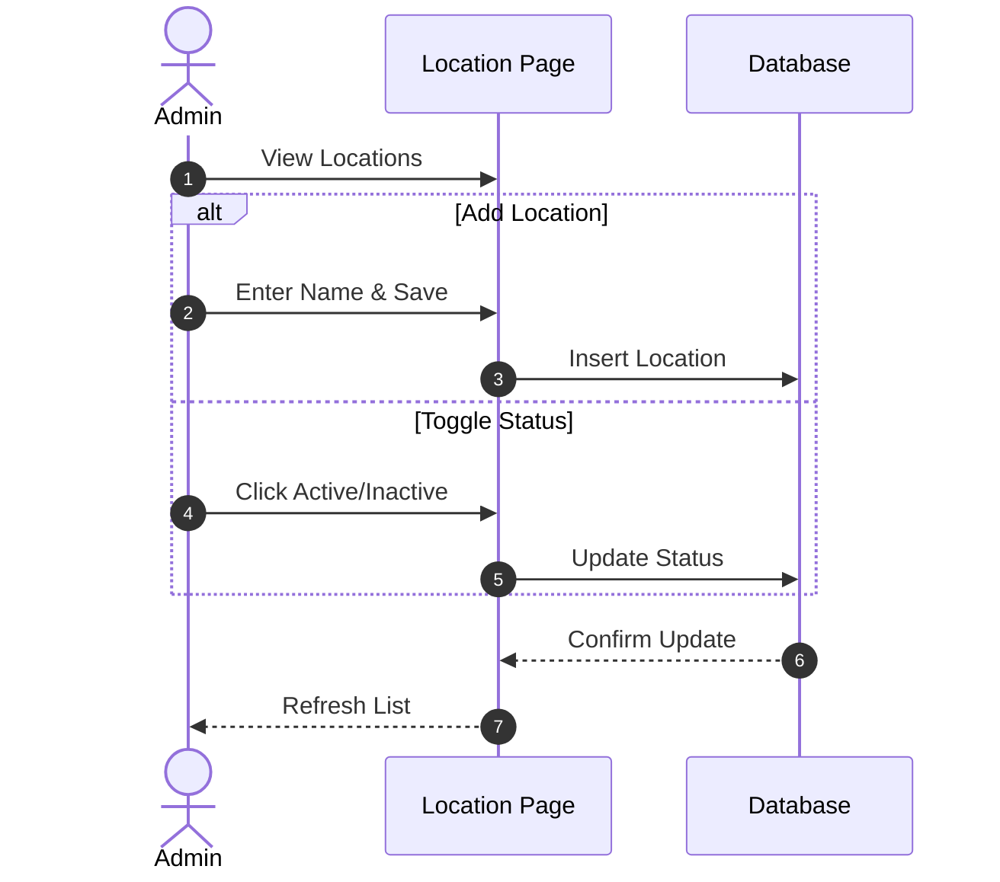

### คำอธิบายขั้นตอน
1. Admin เพิ่มหรือแก้ไขสถานที่
2. สามารถปิดการใช้งาน (Inactive) สถานที่ที่ไม่ใช้แล้วได้โดยไม่ต้องลบถาวร

---

## 9. จัดการข้อมูลประวัติธุรกรรม (Manage Transaction History)
**Use Case ID:** UC-009  
**Description:** Admin ตรวจสอบและแก้ไขข้อมูลประวัติย้อนหลัง

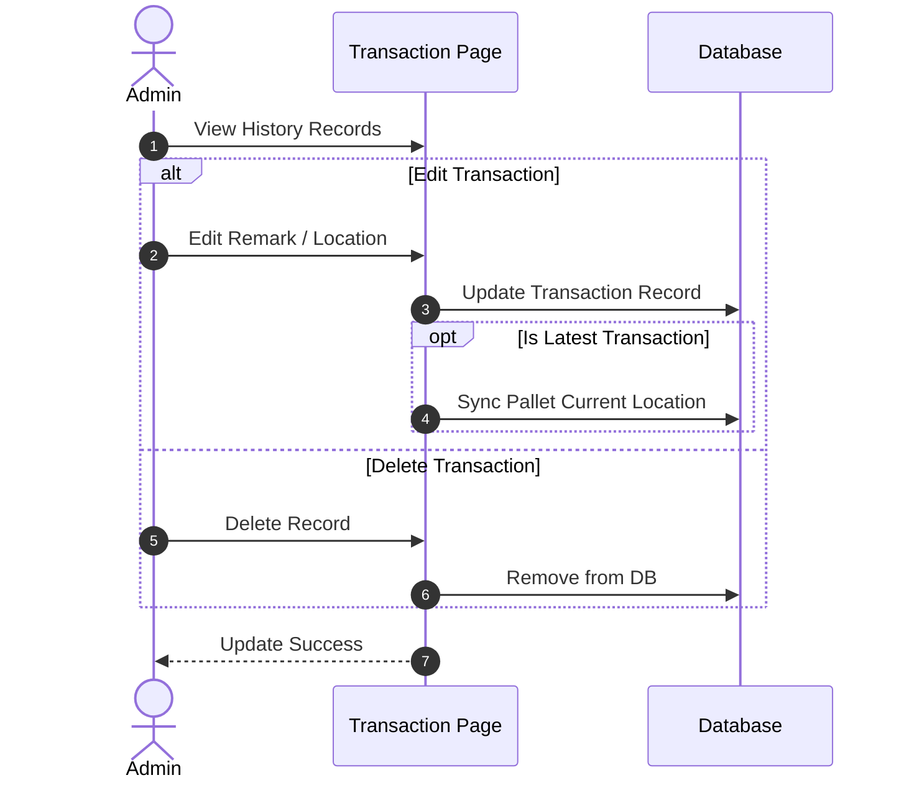

### คำอธิบายขั้นตอน
1. Admin ดูประวัติการทำรายการทั้งหมด
2. หากมีการแก้ไขรายการล่าสุด ระบบจะอัปเดตสถานะปัจจุบันของพาเลทให้สอดคล้องกัน

---

## 10. จัดการข้อมูลรายงาน (Manage Reports)
**Use Case ID:** UC-010  
**Description:** ดู Dashboard และ Export ข้อมูล

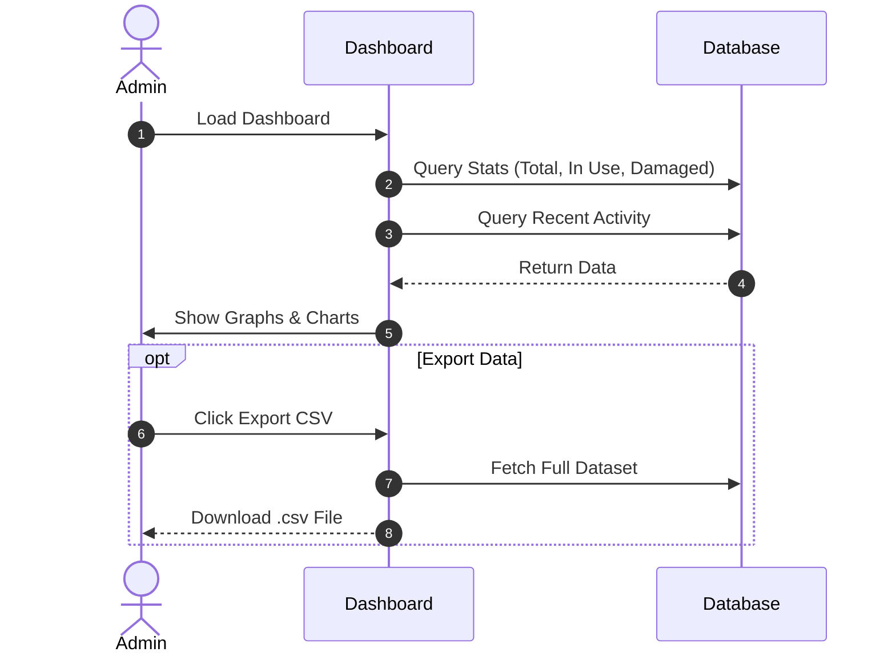

### คำอธิบายขั้นตอน
1. ระบบแสดงภาพรวมสถิติพาเลทบน Dashboard
2. Admin สามารถกดดาวน์โหลดข้อมูลเป็นไฟล์ CSV เพื่อนำไปใช้งานต่อ

---

## 11. จัดการการตั้งค่าระบบ (System Settings)
**Use Case ID:** UC-011  
**Description:** ตั้งค่า Config ต่างๆ ของระบบ

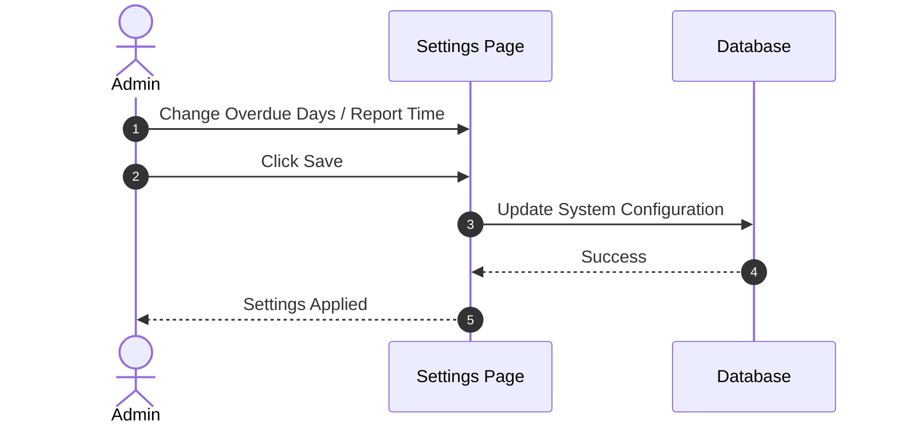

### คำอธิบายขั้นตอน
1. Admin ปรับเปลี่ยนค่าคงที่ของระบบ เช่น จำนวนวันที่ถือว่าเกินกำหนด (Overdue Threshold)
2. บันทึกค่าลงฐานข้อมูลเพื่อให้ระบบนำไปคำนวณ

---

## 12. ลืมรหัสผ่าน (Forget Password)
**Use Case ID:** UC-012  
**Description:** ขอรีเซ็ตรหัสผ่านกรณีลืม

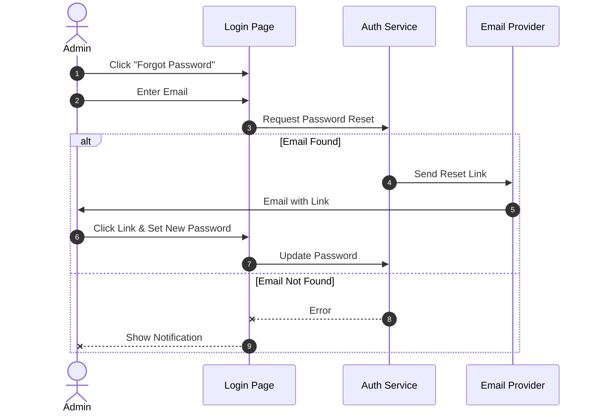

### คำอธิบายขั้นตอน
1. ผู้ใช้กดลืมรหัสผ่านและกรอกอีเมล
2. ระบบส่งลิงก์สำหรับตั้งรหัสผ่านใหม่ไปทางอีเมล
3. ผู้ใช้กดลิงก์และกำหนดรหัสผ่านใหม่

---

## 13. แจ้งเตือนอัตโนมัติ (Automatic Line Notification)
**Use Case ID:** UC-013  
**Description:** ระบบส่งรายงานสรุปไปยัง Line

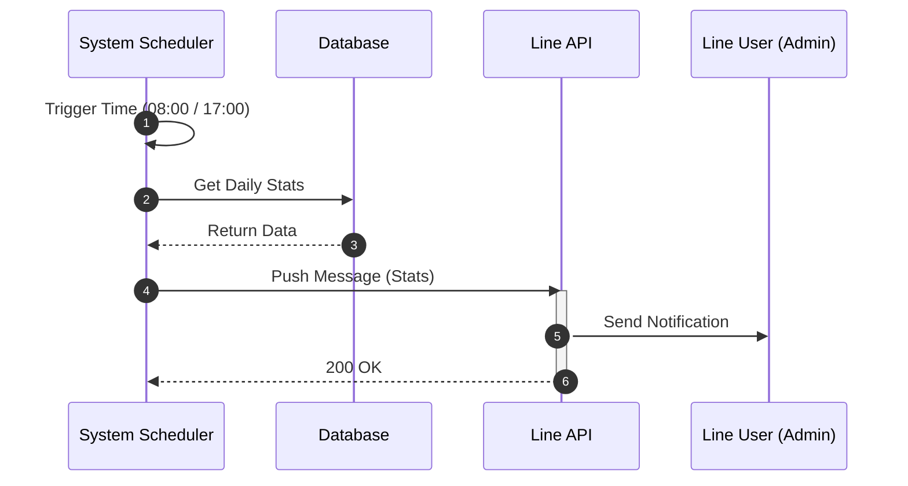

### คำอธิบายขั้นตอน
1. เมื่อถึงเวลาที่กำหนด Scheduler จะดึงข้อมูลสรุป
2. ส่งข้อมูลไปยัง Line Messaging API
3. Admin ได้รับแจ้งเตือนผ่านแอป Line
