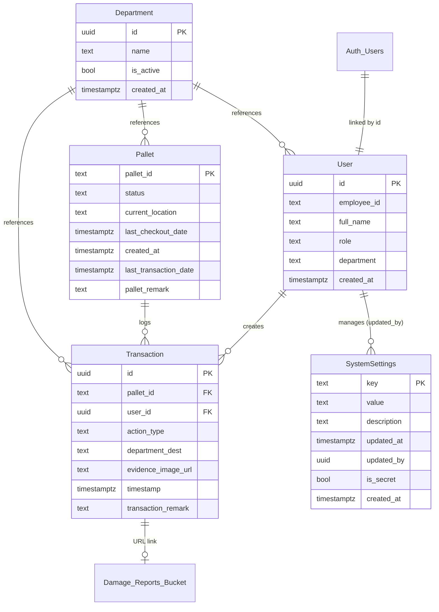

# 3.9 การออกแบบฐานข้อมูล (Database Design)

หัวข้อนี้นำเสนอโครงสร้างการจัดเก็บข้อมูลของระบบ NMT Pallet System ซึ่งออกแบบบนพื้นฐานของ Relational Database (Supabase PostgreSQL) โดยอ้างอิงจากโครงสร้างจริง (Schema) และความสัมพันธ์ระหว่างข้อมูล

---

## 3.9.1 แผนภาพความสัมพันธ์ของข้อมูล (Entity Relationship Diagram)

### **คำอธิบายความสัมพันธ์ (Relationship Explanation)**
โครงสร้างข้อมูลมีความสัมพันธ์กันในลักษณะเชิงหน้าที่ (Functional Relationship) ดังนี้:

1.  **การเชื่อมโยงกับระบบยืนยันตัวตน (Auth Integration)**: ตาราง `public.users` มีความสัมพันธ์แบบ 1:1 กับ `auth.users` โดยใช้ `id` (UUID) เป็นจุดเชื่อมต่อ ข้อมูลโปรไฟล์จะถูกสร้างอัตโนมัติผ่าน Database Trigger เมื่อมีการลงทะเบียน
2.  **ความสัมพันธ์ของธุรกรรม (Transaction Consistency)**: 
    *   **User - Transaction**: ความสัมพันธ์แบบ 1:N (หนึ่งคนทำได้หลายรายการ) เชื่อมโยงผ่าน `user_id`
    *   **Pallet - Transaction**: ความสัมพันธ์แบบ 1:N (หนึ่งใบมีได้หลายประวัติ) เชื่อมโยงผ่าน `pallet_id`
3.  **การจัดการข้อมูลหลัก (Master Data)**: ตาราง `departments` ทำหน้าที่เป็น Master สำหรับการอ้างอิงชื่อแผนกใน `users.department`, `pallets.current_location` และ `transactions.department_dest`
4.  **ตารางการตั้งค่าระบบ (SystemSettings) และ พนักงาน (User)**: เพื่อรองรับการจดบันทึกประวัติการแก้ไขและความโปร่งใส (Audit Log) ตาราง `SystemSettings` มีความสัมพันธ์กับตาราง `User` ผ่านฟิลด์ `updated_by` (Foreign Key) เพื่อระบุว่า **"ผู้ดูแลระบบ (Admin) คนใดเป็นผู้แก้ไขค่าคอนฟิกล่าสุด"** 
5.  **การจัดเก็บไฟล์หลักฐาน (Storage Integration)**: เขตข้อมูล `evidence_image_url` ในตารางธุรกรรมจะเก็บลิงก์อ้างอิงไปยัง **Storage Bucket** ชื่อ `damage_reports`

### **แผนภาพความสัมพันธ์ (ERD)**

---

## 3.9.2 ตารางข้อมูล (Data Table)

### **1. ข้อมูลพนักงาน (User Table)**
| ชื่อเขตข้อมูล | ชนิดข้อมูล | ขนาดข้อมูล | คำอธิบาย | คีย์ | ตารางเชื่อมโยง |
| :--- | :--- | :--- | :--- | :--- | :--- |
| id | uuid | - | รหัสระบุตัวตน (เชื่อมกับ auth.users) | PK | - |
| employee_id | text | - | รหัสประจำตัวพนักงาน | - | - |
| full_name | text | - | ชื่อ-นามสกุลจริง | - | - |
| role | text | - | ระดับสิทธิ์ (staff/admin) | - | - |
| department | text | - | ชื่อแผนกที่สังกัด | - | Department |
| created_at | timestamptz | - | วันเวลาที่สร้างบัญชี | - | - |

### **2. ข้อมูลพาเลท (Pallet Table)**
| ชื่อเขตข้อมูล | ชนิดข้อมูล | ขนาดข้อมูล | คำอธิบาย | คีย์ | ตารางเชื่อมโยง |
| :--- | :--- | :--- | :--- | :--- | :--- |
| pallet_id | text | - | รหัสพาเลท (QR Code) | PK | - |
| status | text | - | สถานะ (available/in_use/damaged) | - | - |
| current_location | text | - | ชื่อแผนกที่อยู่ล่าสุด | - | Department |
| last_checkout_date| timestamptz | - | วันและเวลาที่เบิกออกล่าสุด | - | - |
| created_at | timestamptz | - | วันเวลาที่นำพาเลทเข้าสู่ระบบ | - | - |
| last_transaction_date| timestamptz | - | วันเวลาที่ทำรายการล่าสุด | - | - |
| pallet_remark | text | - | หมายเหตุประจำพาเลท | - | - |

### **3. ข้อมูลรายการธุรกรรม (Transaction Table)**
| ชื่อเขตข้อมูล | ชนิดข้อมูล | ขนาดข้อมูล | คำอธิบาย | คีย์ | ตารางเชื่อมโยง |
| :--- | :--- | :--- | :--- | :--- | :--- |
| id | uuid | - | รหัสรายการธุรกรรม | PK | - |
| pallet_id | text | - | รหัสพาเลทที่เกี่ยวข้อง | FK | Pallets |
| user_id | uuid | - | รหัสผู้ใช้ที่ทำรายการ | FK | Users |
| action_type | text | - | ประเภทธุรกรรม (check_out/in/repair) | - | - |
| department_dest | text | - | ชื่อแผนกปลายทาง | - | Department |
| evidence_image_url| text | - | URL รูปภาพหลักฐาน (Storage) | - | Damage_Reports |
| timestamp | timestamptz | - | วันและเวลาที่เกิดรายการ | - | - |
| transaction_remark| text | - | หมายเหตุของรายการ | - | - |

### **4. ข้อมูลแผนก/สถานที่ (Department Table)**
| ชื่อเขตข้อมูล | ชนิดข้อมูล | ขนาดข้อมูล | คำอธิบาย | คีย์ | ตารางเชื่อมโยง |
| :--- | :--- | :--- | :--- | :--- | :--- |
| id | uuid | - | รหัสประจำสถานที่ | PK | - |
| name | text | - | ชื่อแผนกหรือสถานที่ | - | - |
| is_active | bool | - | สถานะการเปิดใช้งาน | - | - |
| created_at | timestamptz | - | วันเวลาที่สร้างข้อมูล | - | - |

### **5. ข้อมูลการตั้งค่าระบบ (SystemSettings Table)**
| ชื่อเขตข้อมูล | ชนิดข้อมูล | ขนาดข้อมูล | คำอธิบาย | คีย์ | ตารางเชื่อมโยง |
| :--- | :--- | :--- | :--- | :--- | :--- |
| key | text | - | ชื่อการตั้งค่า (Primary Key) | PK | - |
| value | text | - | ค่าของการตั้งค่า | - | - |
| description | text | - | คำอธิบายหน้าที่ของการตั้งค่านั้นๆ | - | - |
| updated_at | timestamptz | - | วันเวลาที่แก้ไขล่าสุด | - | - |
| updated_by | uuid | - | รหัสผู้ใช้ที่แก้ไขล่าสุด | - | User |
| is_secret | bool | - | สถานะค่าความลับ (เช่น Token) | - | - |
| created_at | timestamptz | - | วันเวลาที่เริ่มสร้าง Record | - | - |

**รายการ Key ที่ใช้งานจริงในระบบ:**
*   `admin_email_base`: โดเมนอีเมลหลักสำหรับสร้าง Account
*   `line_channel_token` / `line_target_id`: สำหรับการแจ้งเตือนผ่าน LINE
*   `overdue_days`: จำนวนวันที่กำหนดว่าพาเลทคืนเกินกำหนด
*   `report_scheduled_days` / `report_time_morning` / `report_time_evening`: การตั้งค่าเวลาส่งรายงาน
*   `last_sent_morning` / `last_sent_evening`: บันทึกเวลาที่ส่งรายงานล่าสุด (เพื่อป้องกันการส่งซ้ำ)

---

## 3.9.3 ส่วนประกอบอื่นๆ ของฐานข้อมูล (Database Extensions)

### **1. ฟังก์ชันการประมวลผล (Database Functions / RPC)**
*   `get_active_admins`: คัดกรองรายชื่อผู้ดูแลระบบที่มีสถานะ Active
*   `update_admin_email_base`: ระบบเปลี่ยน Domain Alias ของพนักงานแบบกลุ่ม
*   `admin_reset_password`: ฟังก์ชันสำหรับ Admin รีเซ็ตรหัสผ่านพนักงาน
*   `delete_user_complete`: ฟังก์ชันลบข้อมูล User ทั้งใน Auth และ Profile Table แบบ Atomic

### **2. พื้นที่จัดเก็บไฟล์ (Storage Buckets)**
*   **damage_reports**: เก็บไฟล์ภาพหลักฐานความเสียหาย แยกสิทธิ์การเข้าถึงผ่าน RLS Policy
