# 3.6 ผังงานกระบวนการ (Process Flowchart)

## 3.6.1 ผังงานกระบวนการเข้าสู่ระบบ (Login Flowchart)

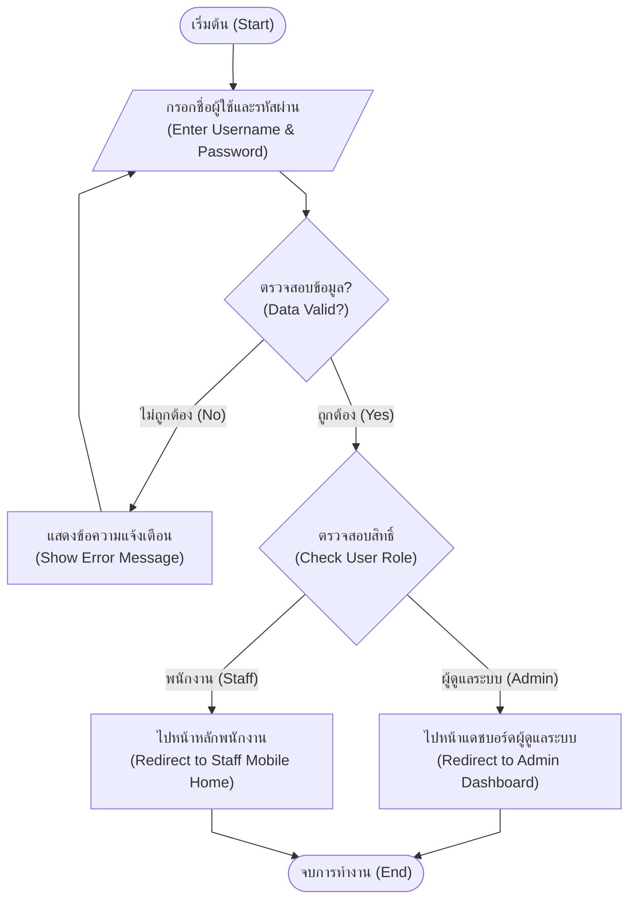

## 3.6.2 ผังงานกระบวนการรีเซ็ตรหัสผ่าน (Reset Password Flowchart)

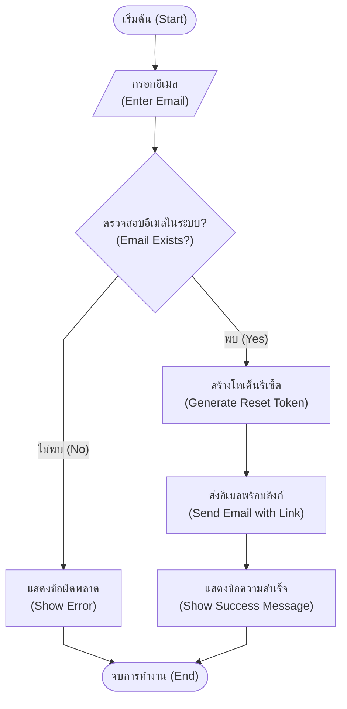

## 3.6.3 ผังงานกระบวนการเบิกพาเลท (Check-out Process)

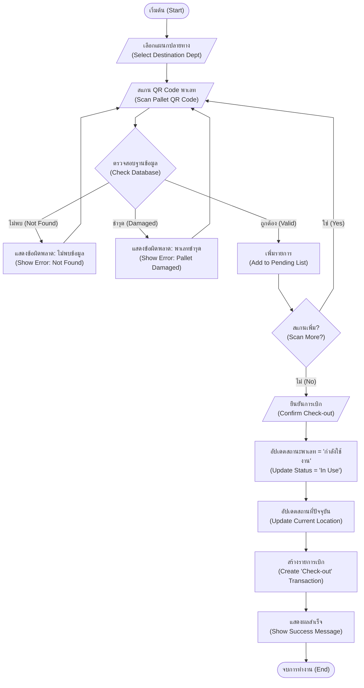

## 3.6.4 ผังงานกระบวนการคืนพาเลท (Check-in Process)

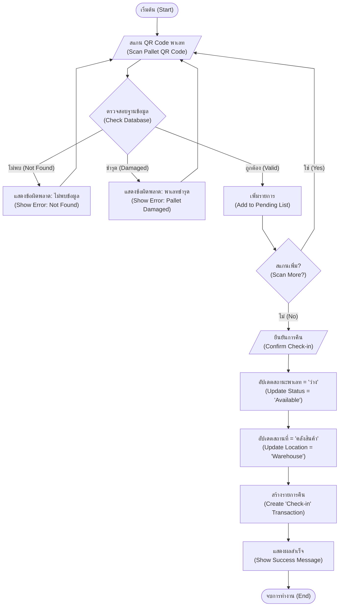

## 3.6.5 ผังงานกระบวนการแจ้งพาเลทชำรุด (Report Damage Process)

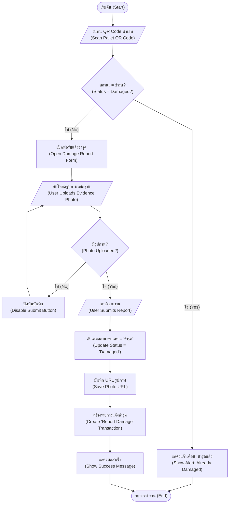

## 3.6.6 ผังงานกระบวนการค้นหาประวัติ (View History Process)

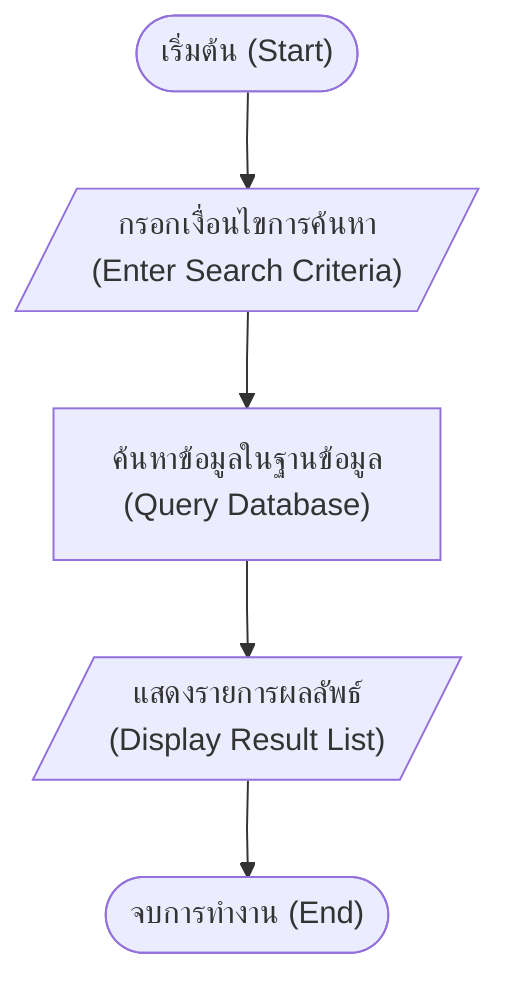

## 3.6.7 ผังงานกระบวนการจัดการข้อมูลหลัก (Master Data Management - CRUD)

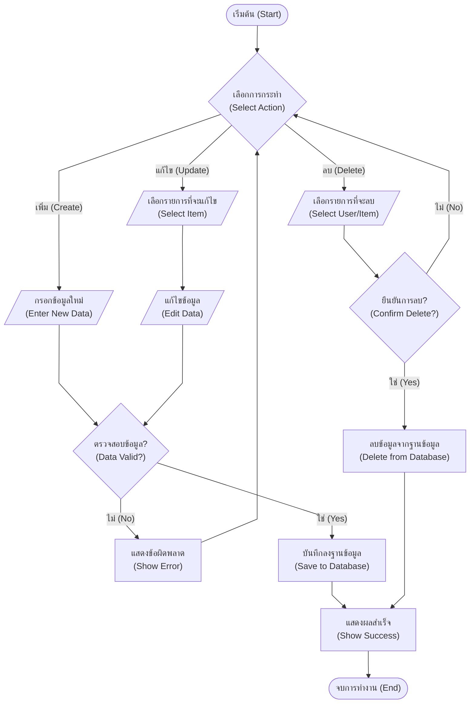

## 3.6.8 ผังงานกระบวนการออกรายงาน (Reporting Process)

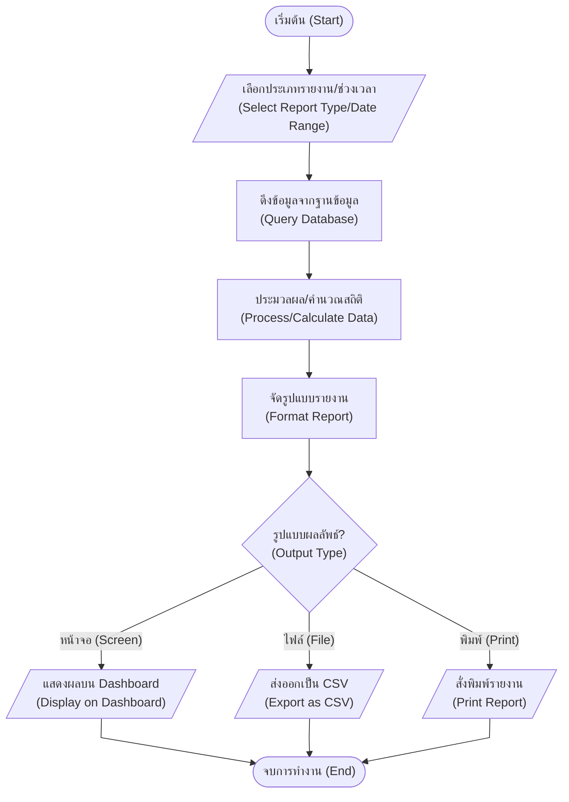

## 3.6.9 ผังงานกระบวนการแจ้งเตือน (Notification Process)

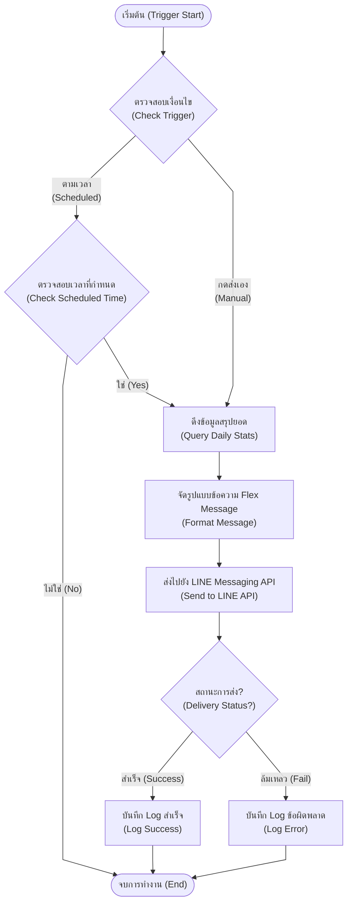
```

## 3.6.10 ผังงานกระบวนการตั้งค่าระบบ (System Configuration Process)

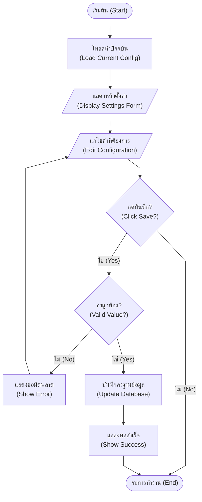

## 3.6.11 ผังงานกระบวนการพิมพ์รหัส QR (QR Code Printing Process)

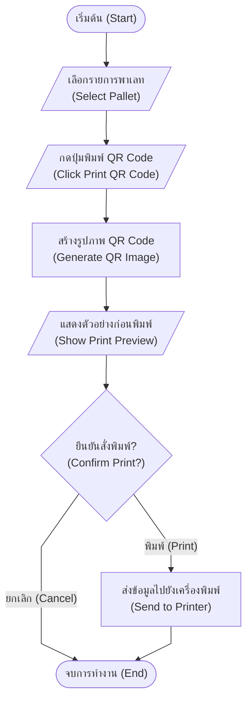

## 3.6.12 ผังงานกระบวนการจัดการพาเลทชำรุด (Resolve Damage Process)

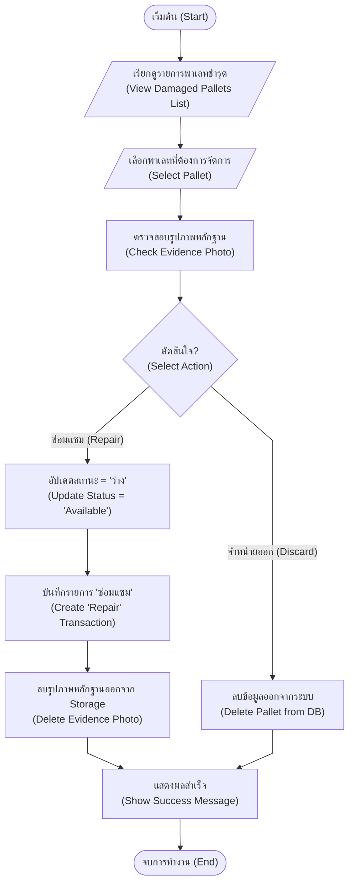
